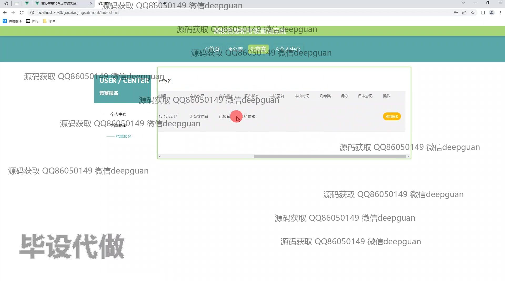
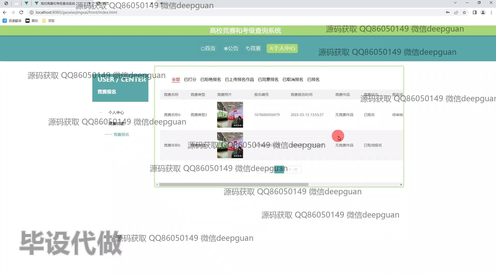

<h1 align="center">基于JAVA的高校竞赛和考级查询系统</h1>

## 简介
高校竞赛和考级查询系统：角色分为管理员、学生、教务处管理员；具有竞赛报名、竞赛管理、公告管理、用户管理等功能，支持信息查询与管理，实现高效的数据处理与互动交流。    --计算机毕业设计源码；毕设源码；java毕业设计源码

## 联系方式

<h3 align="center">获取完整代码与数据库文件 + 微信：deepguan QQ: 86050149 QQ群: 783742310</h3>

<h3 align="center">可帮忙远程部署 包运行成功！提供远程部署、修改代码、设计文档指导、代码讲解等服务！</h3>

## 功能介绍（完整见运行截图）
管理员：支持登录、注册、退出功能，提供公告管理、竞赛管理、用户管理和统计报表功能，可编辑学院负责人信息及其权限，包括修改、删除、密码重置等操作。支持竞赛类型、公告类型及基础数据的管理，提供公告和竞赛发布、查看及编辑功能，方便维护系统内容。

## 运行截图

本代码来源于网络,仅供学习参考使用!

